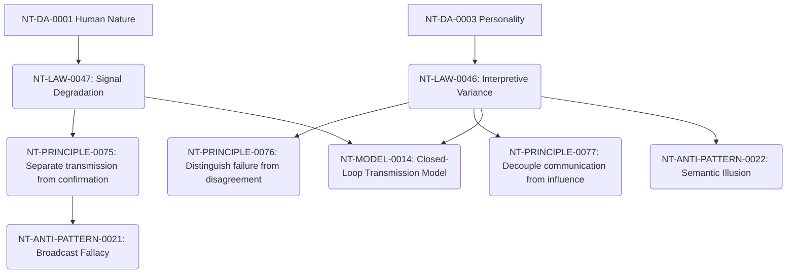

# Communication Cross-Domain Dependency Mapping

**Domain Area:** NT-DA-0008  
**Slug:** communication  
**Status:** ready_for_review  

## Upstream Dependencies

| Upstream Domain Area | Dependency Kind | Rationale |
| --- | --- | --- |
| **NT-DA-0001 Human Nature** | authoring_prerequisite | Baseline cognitive limits shape how much information can be processed. |
| **NT-DA-0003 Personality** | authoring_prerequisite | Trait defaults dictate differing interpretive frameworks and communication preferences. |

## Downstream Dependencies

| Target Domain Area | Dependency Kind | Rationale |
| --- | --- | --- |
| **All Other Domains** | foundational | Delegation, Team Building, Trust, and Execution all require closed-loop communication to function. |

## Knowledge Unit Flow

