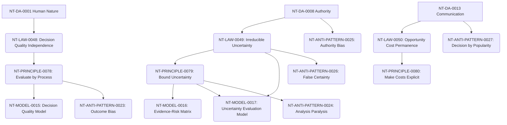

# Decision Making Cross-Domain Dependency Mapping

**Domain Area:** NT-DA-0015  
**Slug:** decision-making  
**Status:** ready_for_review  

## Upstream Dependencies

| Upstream Domain Area | Dependency Kind | Rationale |
| --- | --- | --- |
| **NT-DA-0001 Human Nature** | authoring_prerequisite | Decision Making relies on understanding cognitive biases, load limits, and threat responses to explain why optimal decisions often fail. |
| **NT-DA-0008 Authority** | authoring_prerequisite | Understanding who holds legitimate power is necessary to establish final decision rights. |
| **NT-DA-0013 Communication** | authoring_prerequisite | Gathering evidence and framing choices requires effective transmission of information. |

## Downstream Domain Areas

| Target Domain Area | Dependency Kind | Rationale |
| --- | --- | --- |
| **NT-DA-0016 Strategy** | authoring_prerequisite | Strategy is essentially a series of high-level, high-stakes decisions requiring tradeoffs. |
| **NT-DA-0017 Execution** | authoring_prerequisite | Execution is the realization of the commitment made during the decision process. |
| **NT-DA-0012 Negotiation** | authoring_prerequisite | Negotiation involves joint decision making under conflicting interests. |

## Recommended Authoring Order

