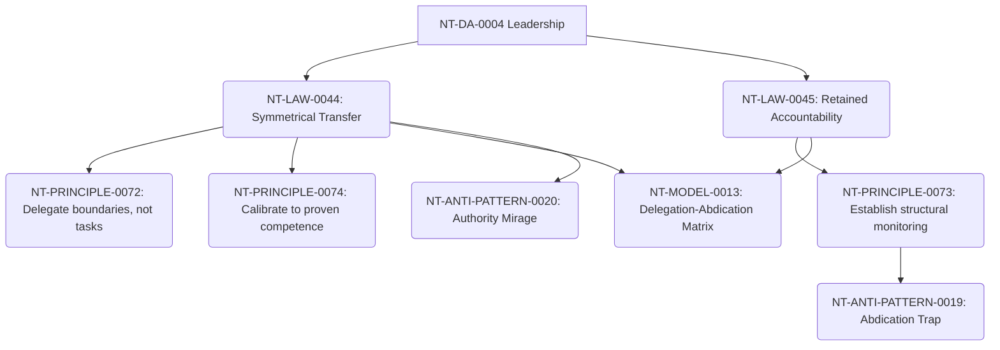

# Delegation Cross-Domain Dependency Mapping

**Domain Area:** NT-DA-0007  
**Slug:** delegation  
**Status:** ready_for_review  

## Upstream Dependencies

| Upstream Domain Area | Dependency Kind | Rationale |
| --- | --- | --- |
| **NT-DA-0004 Leadership** | authoring_prerequisite | Delegation consumes the trust and credibility generated by Leadership. |

## Knowledge Unit Flow

