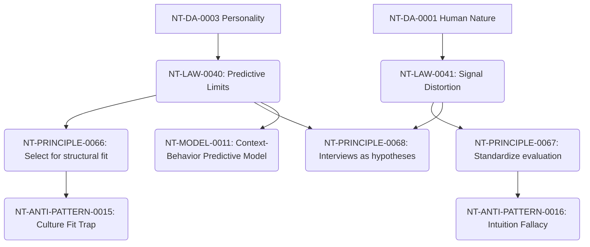

# Hiring Cross-Domain Dependency Mapping

**Domain Area:** NT-DA-0005  
**Slug:** hiring  
**Status:** ready_for_review  

## Upstream Dependencies

| Upstream Domain Area | Dependency Kind | Rationale |
| --- | --- | --- |
| **NT-DA-0001 Human Nature** | authoring_prerequisite | Selection must account for cognitive biases. |
| **NT-DA-0003 Personality** | authoring_prerequisite | Hiring must avoid the tyranny of typology. |
| **NT-DA-0004 Leadership** | authoring_prerequisite | Leaders are the primary agents of selection. |

## Knowledge Unit Flow

