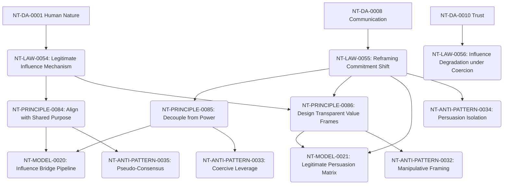

# Influence Cross-Domain Dependency Mapping

**Domain Area:** NT-DA-0014  
**Slug:** influence  
**Status:** frozen  

## Upstream Dependencies

| Upstream Domain Area | Dependency Kind | Rationale |
| --- | --- | --- |
| **NT-DA-0001 Human Nature** | authoring_prerequisite | Influence relies on understanding human perception, threat reflexes, and cognitive filters. |
| **NT-DA-0008 Communication** | authoring_prerequisite | Influence requires clear signal framing and meaning transmission channels. |
| **NT-DA-0010 Trust** | authoring_prerequisite | Legitimate influence depends on established structural trust and vulnerability acceptance. |

## Downstream Domain Areas

| Target Domain Area | Dependency Kind | Rationale |
| --- | --- | --- |
| **NT-DA-0015 Decision-Making** | authoring_prerequisite | Influence shifts how options and uncertainty are evaluated before decisions are finalized. |
| **NT-DA-0017 Execution** | authoring_prerequisite | Influence ensures voluntary commitment during effort mobilization. |
| **NT-DA-0012 Negotiation** | authoring_prerequisite | Influence shapes the perceived value baseline prior to formal concession exchanges. |

## Recommended Authoring Order

