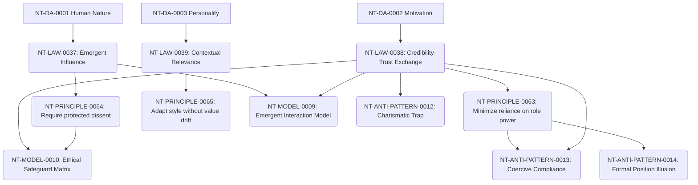

# Leadership Cross-Domain Dependency Mapping

**Domain Area:** NT-DA-0004  
**Slug:** leadership  
**Status:** ready_for_review  

## Upstream Dependencies

| Upstream Domain Area | Dependency Kind | Rationale |
| --- | --- | --- |
| **NT-DA-0001 Human Nature** | authoring_prerequisite | Leadership relies on understanding basic human threat responses, safety, status needs, and learning dynamics to establish credibility. |
| **NT-DA-0002 Motivation** | authoring_prerequisite | Influencing voluntary effort and engagement requires understanding intrinsic drive and avoiding fear-based obedience. |
| **NT-DA-0003 Personality** | authoring_prerequisite | Leaders must adapt behaviors to align with members' trait preferences and manage adaptation costs. |

## Downstream Domain Areas

| Target Domain Area | Dependency Kind | Rationale |
| --- | --- | --- |
| **NT-DA-0007 Delegation** | authoring_prerequisite | Delegating authority and responsibility requires trust, safety, and clear direction set by leadership. |
| **NT-DA-0006 Team Building** | authoring_prerequisite | Designing cohesive teams and leveraging cognitive diversity requires leadership to model psychological safety. |
| **NT-DA-0015 Decision-Making** | authoring_prerequisite | Leadership establishes the boundaries of consultation, consensus, and decision rules. |
| **NT-DA-0019 Culture** | authoring_prerequisite | Leadership behaviors and structural constraints actively shape organizational norms and culture. |
| **NT-DA-0017 Execution** | authoring_prerequisite | Mobilizing effort toward goals and managing recovery loops relies on direction and pacing from leadership. |

## Recommended Authoring Order

To manage complexity and respect dependencies, the future content within NT-DA-0004 should be authored in the following order:

