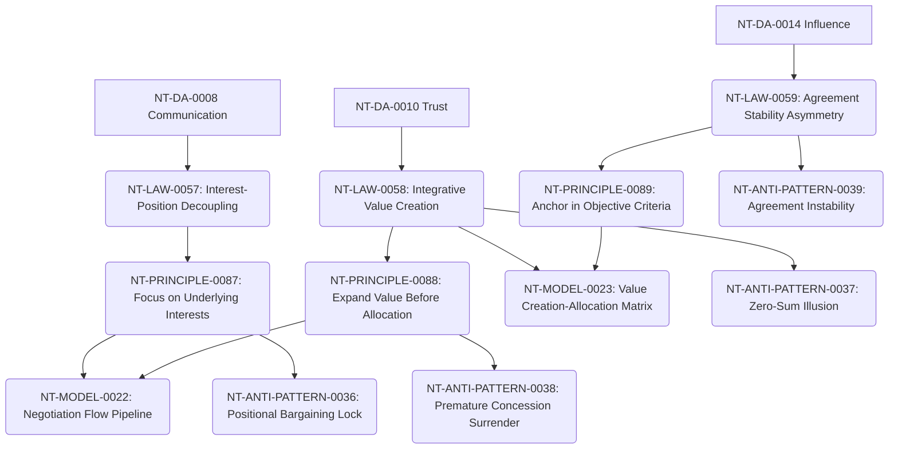

# Negotiation Cross-Domain Dependency Mapping

**Domain Area:** NT-DA-0012  
**Slug:** negotiation  
**Status:** frozen  

## Upstream Dependencies

| Upstream Domain Area | Dependency Kind | Rationale |
| --- | --- | --- |
| **NT-DA-0008 Communication** | authoring_prerequisite | Negotiation requires clear framing and information exchange. |
| **NT-DA-0010 Trust** | authoring_prerequisite | Negotiation requires vulnerability acceptance to share true interests. |
| **NT-DA-0014 Influence** | authoring_prerequisite | Negotiation relies on reframing priorities prior to deal closure. |

## Downstream Domain Areas

| Target Domain Area | Dependency Kind | Rationale |
| --- | --- | --- |
| **NT-DA-0015 Decision-Making** | authoring_prerequisite | Negotiation produces the agreed alternatives that leaders commit to. |
| **NT-DA-0017 Execution** | authoring_prerequisite | Executable negotiation terms define accountability during task delivery. |

## Recommended Authoring Order

