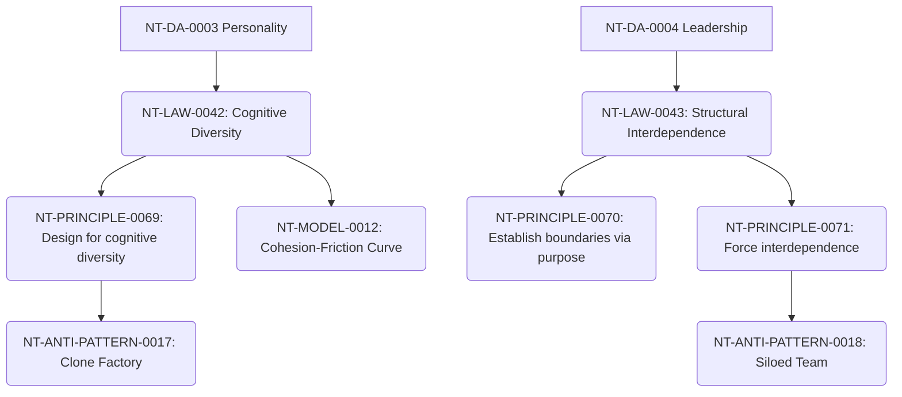

# Team Building Cross-Domain Dependency Mapping

**Domain Area:** NT-DA-0006  
**Slug:** team-building  
**Status:** ready_for_review  

## Upstream Dependencies

| Upstream Domain Area | Dependency Kind | Rationale |
| --- | --- | --- |
| **NT-DA-0003 Personality** | authoring_prerequisite | Team composition relies on understanding complementary trait defaults. |
| **NT-DA-0004 Leadership** | authoring_prerequisite | Leaders are responsible for designing structural interdependence. |
| **NT-DA-0005 Hiring** | authoring_prerequisite | Selection provides the raw material (individuals) that must be integrated. |

## Downstream Dependencies

| Target Domain Area | Dependency Kind | Rationale |
| --- | --- | --- |
| **NT-DA-0010 Trust** | limits_scope | Trust emerges within the structural bounds set by team building. |
| **NT-DA-0011 Conflict** | limits_scope | Cognitive diversity naturally generates conflict, requiring resolution frameworks. |

## Knowledge Unit Flow

