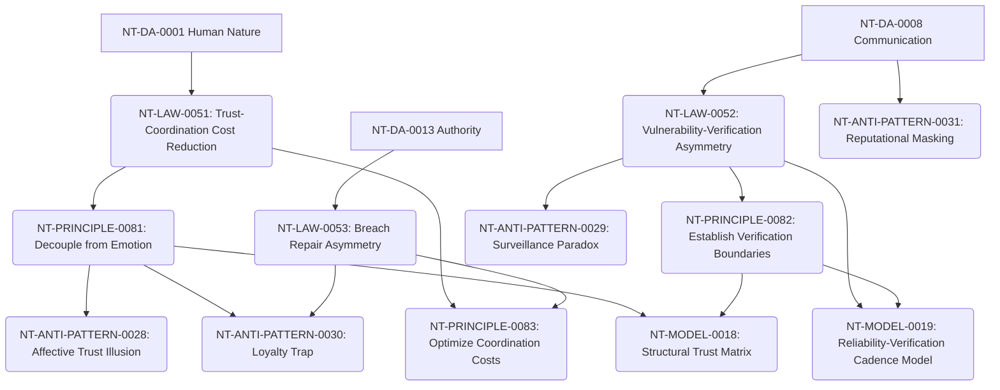

# Trust Cross-Domain Dependency Mapping

**Domain Area:** NT-DA-0010  
**Slug:** trust  
**Status:** ready_for_review  

## Upstream Dependencies

| Upstream Domain Area | Dependency Kind | Rationale |
| --- | --- | --- |
| **NT-DA-0001 Human Nature** | authoring_prerequisite | Trust relies on fundamental biological threat/safety filters and vulnerability dynamics. |
| **NT-DA-0008 Communication** | authoring_prerequisite | Trust requires transparent signal transmission, candor, and bad-news channel protection. |
| **NT-DA-0013 Authority** | authoring_prerequisite | Trust operates within decision rights and formal boundary definitions. |

## Downstream Domain Areas

| Target Domain Area | Dependency Kind | Rationale |
| --- | --- | --- |
| **NT-DA-0007 Delegation** | authoring_prerequisite | Delegating authority without micromanagement requires calibrated trust boundaries. |
| **NT-DA-0006 Team Building** | authoring_prerequisite | High-velocity team coordination requires structural trust to eliminate redundant checks. |
| **NT-DA-0019 Culture** | authoring_prerequisite | Organizational culture is anchored in institutional trust defaults and transparency. |

## Recommended Authoring Order

